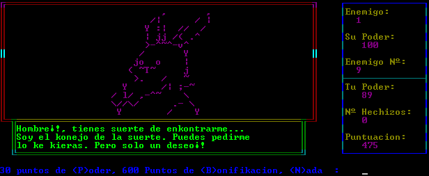

Pruebas 
======== 
by Joan Alba Maldonado (joanalbamaldonadoNO_SPAM_PLEASE AT gmail DOT com, without NO_SPAM_PLEASE)

Mix of text adventure game and RPG totally written in QBasic.

Created in 1996 or 1997.

You can donate at http://sourceforge.net/donate/index.php?group_id=173754

Description

Open source game combination of text adventure and RPG written in Microsoft QBasic (under MS-DOS 6.22).

It is one of my first games that I created in 1996 or 1997 (I can't remember), when I was about 12 years old (my birthday is in November). It is in Spanish language.

Runs natively under MS-DOS and compatible operating systems like Windows (you can use emulators like DosBox to run it under BeOS, Linux, *BSD, etc).

Official web site: http://pruebas.tuxfamily.org/ (mirror at http://www.dhtmlgames.com/pruebas/).